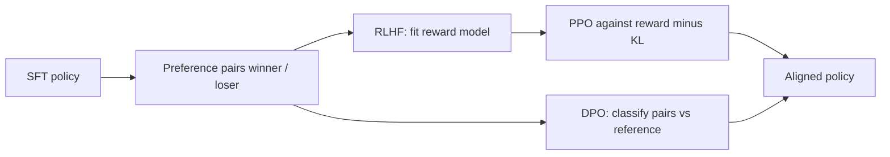

# Alignment: SFT to Preference Optimization

Pretraining teaches *what text looks like*. SFT teaches *how to answer a request*. **Alignment** here means a further step: among many fluent answers, prefer the ones a rater (human or AI) would rank higher — helpful, harmless, honest enough for the product.

This lesson is a **map**, not a second RL course. The MDP, advantage, and PPO math live in Chapters 20–21; the 2022–2026 product stack is in **21-99**. Read those if you need derivations. Here we only place the stages in the LLM pipeline.

## 1. The usual three-stage picture

```
pretrained LM  →  SFT (demonstrations)  →  preference optimization
```

**Stage A — SFT.** Collect (prompt, demonstration) pairs. Minimize next-token loss on the demonstration tokens. You already met this in **26-02**. SFT is ordinary supervised learning on a curated distribution.

**Stage B — a preference model (classic RLHF).** Collect pairs $$(y_w, y_l)$$ for the same prompt: a *winner* and a *loser*. Train a reward model $$r_\phi$$ so that $$r_\phi(x, y_w) > r_\phi(x, y_l)$$, typically with a Bradley–Terry / logistic loss. Then treat the LM as a policy $$\pi_\theta$$ that emits tokens (actions) and optimize expected reward with a **KL penalty** toward the SFT reference, so the policy does not wander into gibberish that fools $$r_\phi$$.

[Ouyang et al., 2022](https://arxiv.org/abs/2203.02155) (InstructGPT) popularized this loop with PPO. Chapter 21 already has actor–critic; **21-99** writes the LM version.

**Stage C — preference optimization without a sampling loop.** [Rafailov et al., 2023](https://arxiv.org/abs/2305.18290) (DPO) rewrite the constrained RL optimum as a classification loss on the same pairs $$(y_w, y_l)$$, comparing $$\pi_\theta$$ to a frozen reference $$\pi_{\mathrm{ref}}$$. No reward model and no PPO sampler at train time. Open-source stacks (for example [trl](https://github.com/huggingface/trl)) made this the default recipe for many 2024–2025 instruct models.

The next section writes the **high-level objectives** so you can read a paper abstract. You do **not** need to re-derive DPO here. Remember the contract:

$$\text{SFT fixes the support (what kind of answers exist); preferences reweight that support.}$$

If SFT data never show refusals, citations, or tool calls, preference training cannot invent those skills from a scalar “better/worse” alone.

## 2. Objectives you should be able to write (not obscure variants)

Treat the LM as a policy $$\pi_\theta(y\mid x)$$ that emits a token sequence $$y$$ given prompt $$x$$. Full PPO / advantage math stays in Chapters 20–21; **21-99** is the LM-shaped recap. We omit named cousins (IPO, KTO, ORPO, …) unless you open those papers yourself.

**Policy gradient (REINFORCE-shaped).** A return or advantage $$\hat{A}$$ multiplies the score function:

$$\nabla_\theta J(\theta) \approx \mathbb{E}_{x,y\sim\pi_\theta}\big[\,\hat{A}(x,y)\,\nabla_\theta \log\pi_\theta(y\mid x)\,\big].$$

For an autoregressive LM, $$\log\pi_\theta(y\mid x) = \sum_t \log\pi_\theta(y_t\mid x, y_{<t})$$ — the same sum as the SFT NLL, with a *weight* $$\hat{A}$$ instead of “always 1.”

**RLHF as KL-regularized reward.** After a reward model $$r_\phi$$ is fit on pairs, the usual goal ([Ouyang et al., 2022](https://arxiv.org/abs/2203.02155)) is

$$\max_\theta\; \mathbb{E}_{x\sim\mathcal{D},\, y\sim\pi_\theta}\big[r_\phi(x,y)\big] - \beta\,\mathrm{KL}\big(\pi_\theta(\cdot\mid x)\,\|\,\pi_{\mathrm{ref}}(\cdot\mid x)\big).$$

The KL term is why the policy does not collapse into a reward-hacking dialect that $$r_\phi$$ likes and humans do not. $$\pi_{\mathrm{ref}}$$ is typically the SFT checkpoint.

**PPO clip (the optimizer, not the product).** PPO ([Schulman et al., 2017](https://arxiv.org/abs/1707.06347)) maximizes a *clipped* surrogate on the probability ratio $$r_t(\theta) = \pi_\theta(a_t\mid s_t)/\pi_{\mathrm{old}}(a_t\mid s_t)$$:

$$L^{\mathrm{CLIP}}(\theta) = \mathbb{E}\Big[\min\big(r_t(\theta)\,\hat{A}_t,\; \mathrm{clip}(r_t(\theta), 1-\varepsilon, 1+\varepsilon)\,\hat{A}_t\big)\Big].$$

In the LM, $$a_t$$ is a token and $$s_t$$ is the prefix. InstructGPT used this loop; it is expensive (sampler, often a value head, instability).

**DPO (preferences without the sampler).** [Rafailov et al., 2023](https://arxiv.org/abs/2305.18290) solve the KL-regularized problem in closed form and obtain a *classification* loss on the same pairs $$(y_w, y_l)$$:

$$\mathcal{L}_{\mathrm{DPO}}(\theta) = -\log\sigma\Big(\beta\log\frac{\pi_\theta(y_w\mid x)}{\pi_{\mathrm{ref}}(y_w\mid x)} - \beta\log\frac{\pi_\theta(y_l\mid x)}{\pi_{\mathrm{ref}}(y_l\mid x)}\Big).$$

Intuition: raise the implicit reward gap between winner and loser, measured in log-odds *relative to the reference*. No $$r_\phi$$ and no PPO rollout at train time. That is the contract; the derivation is in the paper and in **21-99**.



## 3. What alignment is *not*

- **Not a replacement for retrieval.** Preferences do not add facts that were never in pretraining or in the prompt (Chapter 18-99).
- **Not a full safety proof.** Raters encode a policy; they do not certify robustness. Jailbreaks and distribution shift remain evaluation problems.
- **Not only RL.** RLHF is one implementation. DPO, other pairwise losses, and even careful SFT-only pipelines are alignment *in the product sense*.
- **Not the same as distillation.** Distillation copies a teacher’s behavior into a smaller student (**26-05**). Alignment changes *which* behaviors are preferred. You can distill an already-aligned teacher; that is common for small product tiers.

## 4. A self-study sketch you can draw on paper

For one prompt $$x$$:

1. Sample or write two completions $$y_1, y_2$$ from the SFT model.
2. A rater marks $$y_w \succ y_l$$.
3. *RLHF path:* fit $$r_\phi$$; run PPO on $$\pi_\theta$$ with reward $$r_\phi - \beta \log(\pi_\theta/\pi_{\mathrm{ref}})$$.
4. *DPO path:* push up $$\log\pi_\theta(y_w\mid x)$$ relative to $$\log\pi_\theta(y_l\mid x)$$, scaled against the same logs under $$\pi_{\mathrm{ref}}$$.

If you can explain why the KL / reference term exists (reward hacking, style collapse), you are ready for Chapter 21-99. If you only need the product story, stop here.

## 5. Where to go next in this course

- **Chapters 20–21** — states, actions, returns, PPO.
- **21-99** — RLHF, DPO, GRPO for reasoning models.
- **26-04** — serving the aligned policy cheaply.
- **26-05** — shrinking an aligned teacher without redoing preference collection from scratch.

## Further reading

- Ouyang et al., 2022. [Training language models to follow instructions with human feedback](https://arxiv.org/abs/2203.02155) (InstructGPT / RLHF + PPO).
- Schulman et al., 2017. [Proximal Policy Optimization Algorithms](https://arxiv.org/abs/1707.06347).
- Rafailov et al., 2023. [Direct Preference Optimization](https://arxiv.org/abs/2305.18290).
- Topic-map inspiration (not quoted): [Alisa’s Book of LLMs](https://alisawuffles.notion.site/alisa-s-book-of-llms).

## Key takeaways

- Alignment in this chapter = SFT then preference reweighting.
- Write three lines: policy gradient $$\hat{A}\nabla\log\pi$$; RLHF = reward minus $$\beta\,\mathrm{KL}$$ to a reference; PPO clips the probability ratio.
- DPO is the same KL-regularized optimum as a logistic loss on $$(y_w, y_l)$$ — no reward model at train time.
- Skills come from data (and tools); preferences rank skills you already have.
- Full RL derivations stay in Chapters 20–21 — do not duplicate them here.
