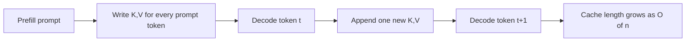
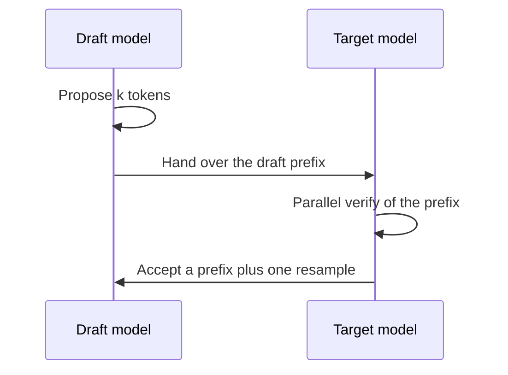

# Serving and Efficiency for LLMs

A pretrained, instructed, aligned decoder is still expensive **per generated token**. Training is a one-off (or rare) bill; serving is the bill that scales with users. This lesson lists the knobs you should name before you reach for distillation.

The compression math — quantization grids, pruning scores, classical KD — stays in **Chapter 23**. The LLM-specific recipes (GPTQ, AWQ, GGUF, speculative decoding) are in **23-99**. Here we only answer: *what is expensive at decode time, and when is a smaller student the right next step?*

## 1. Prefill vs decode

Autoregressive generation has two phases:

**Prefill.** The full prompt (system + history + user + retrieved text) is consumed in parallel. You pay attention over the prompt length once and write a **KV-cache**: for each layer and each prompt token, store the key and value vectors.

**Decode.** You emit one new token at a time. Without a cache you would recompute attention from scratch on the growing prefix (roughly $$O(t^2)$$ work by step $$t$$). With a cache you append one new $$k,v$$ and attend against the stored prefix — about $$O(t)$$ attention work per new token, plus the MLP.

That is the same KV-cache already named in **08-99**. Serving systems (vLLM, SGLang, llama.cpp) are mostly: *manage many caches, batch the matrix multiplies, and overlap I/O*.

Memory, not just FLOPs, often dominates. The cache for a long conversation is

$$\mathrm{bytes} \approx 2 \cdot L \cdot n_{\mathrm{layers}} \cdot n_{\mathrm{kv\_heads}} \cdot d_{\mathrm{head}} \cdot b$$

(the factor 2 is keys and values; $$b$$ is bytes per element; grouped-query attention shrinks $$n_{\mathrm{kv\_heads}}$$). This is why long context is a **product** decision, not only a quality decision.

GQA / MQA (**26-07**, **07-99**) shrink $$n_{\mathrm{kv\_heads}}$$. FlashAttention does **not** shrink the cache; it shrinks the IO of computing attention against that cache (tiling + online softmax, **26-01** / **26-07**). Order-of-magnitude training FLOPs and the “weights + KV” memory identity are in **26-07**.

## 2. Batching and packing

A single decode step is a skinny matmul: batch 1, sequence 1, huge weights. GPUs want fat matmuls. **Continuous batching** (iteration-level scheduling; the vLLM picture) keeps the device busy by admitting a new request when another request finishes a sequence, instead of waiting for a static batch to complete. **Sequence packing** is the training-time cousin: concatenate short documents inside one window and mask so tokens do not attend across a document boundary. Same idea — do not pay for padding you will ignore.

Prefill of a shared system prompt can be computed once and **prefix-cached**. That is batching in time rather than across users.

## 3. Sampling: temperature, top-$$k$$, top-$$p$$

Decode is not always $$\arg\max$$. Given logits $$z$$,

$$p_i^{(T)} = \frac{\exp(z_i / T)}{\sum_j \exp(z_j / T)}.$$

$$T \to 0$$ is greedy; $$T = 1$$ is the trained distribution; $$T > 1$$ flattens (more surprise, more breakage). **Top-$$k$$** zeroes every logit outside the $$k$$ largest, then renormalizes. **Nucleus / top-$$p$$** ([Holtzman et al., 2020](https://arxiv.org/abs/1904.09751)) keeps the *smallest* set of tokens whose cumulative probability is at least $$p$$, then renormalizes. Temperature changes *shape*; top-$$k$$ / top-$$p$$ change *support*. They compose: scale by $$T$$, truncate, then sample.

Do not confuse this $$T$$ with the distillation temperature in **26-05**. Same algebra; different job (decode diversity vs soft teacher).

## 4. Speculative decoding (draft + verify)

[Leviathan et al., 2023](https://arxiv.org/abs/2211.17192) (and parallel work) use a cheap **draft** model to propose several tokens; the large **target** verifies that prefix in one parallel forward. Tokens the target would have sampled are accepted; at the first disagreement you resample from the *adjusted* target distribution and drop the rest of the draft. Implemented correctly, the output law is the target’s, not the draft’s. You spend extra draft FLOPs to buy target forwards.

This is a *serving* trick, not a new trained student. If you need a smaller architecture, that is distillation (**26-05**).

## 5. Quantization is the first cheap win

Storing weights in 16-bit instead of 32-bit, then 8-bit or 4-bit, cuts memory and can cut bandwidth-bound decode time. Chapter 23 gives the rounding picture; **23-99** names GPTQ / AWQ / GGUF as the recipes people actually run on 7B–70B decoders.

Quantization **does not** train a new model. It approximates the same $$\theta$$ with fewer bits. Use it when:

- you own or may redistribute that checkpoint,
- quality drop is acceptable after a quick eval,
- you need the *same* behavior at lower RAM (laptops, a single GPU, edge).

If 4-bit still misses a latency or cost target, you need fewer layers/width or fewer active parameters (MoE routing — also in 23-99) — or a **student**.

## 6. Other serving levers (so you do not overfit on distillation)

- **Prompt caching / prefix sharing.** Many requests share a system prompt; reuse that prefill (section 2).
- **Retrieval vs long context.** Stuffing a book into $$L$$ is often slower and worse than retrieving (18-99).
- **Adapters (LoRA / QLoRA).** Specialize without serving a full extra copy of every expert (Chapter 15 optional).
- **Accounting.** If you need $$N$$, activation size, or $$C \approx 6NT$$, open **26-07** rather than guessing.

None of these *transfer knowledge into a smaller architecture*. They make the teacher cheaper to run.

## 7. When to distill

Reach for distillation (**26-05**) when at least one of these is true:

1. **Architecture must shrink.** Quantization cannot delete layers. A 70B teacher that must become a 7–8B (or a mobile) student needs a new $$\theta$$.
2. **You want a cheaper product tier** with similar *behavior*, not a bit-exact clone — in-house, on a teacher you are allowed to train from.
3. **You will fine-tune many specialists.** Distill a general student once, then LoRA each specialist.
4. **White-box internals are available** and you care about matching hidden states or token distributions, not only text.

Do **not** distill first if you have not tried 4-bit weights, a sane context limit, and batching. Distillation is a training project; quantization is often a conversion flag.

Also do not distill a teacher you are not licensed or contracted to train from. The next lesson separates ordinary in-house / open-license distillation from harvesting an API you do not control.

## Further reading

- Leviathan et al., 2023. [Fast Inference from Transformers via Speculative Decoding](https://arxiv.org/abs/2211.17192).
- Holtzman et al., 2020. [The Curious Case of Neural Text Degeneration](https://arxiv.org/abs/1904.09751) (nucleus sampling).
- Kwon et al., 2023. [Efficient Memory Management for Large Language Model Serving with PagedAttention](https://arxiv.org/abs/2309.06180).
- Topic-map inspiration (not quoted): [Alisa’s Book of LLMs](https://alisawuffles.notion.site/alisa-s-book-of-llms).

## Key takeaways

- Decode cost = MLP + attending over a growing **KV-cache** ($$O(n)$$ memory in the cached length).
- Continuous batching / packing fill the GPU; speculative decoding is draft + parallel verify.
- Temperature reshapes $$p$$; top-$$k$$ / top-$$p$$ cut support. Same $$T$$ algebra as KD, different job.
- Quantization and batching are the default efficiency tools (Chapter 23 / 23-99).
- Distillation is the tool for a *new, smaller* network that *imitates* a teacher.
- Decide “cache / quantize / retrieve” before “train a student.”
