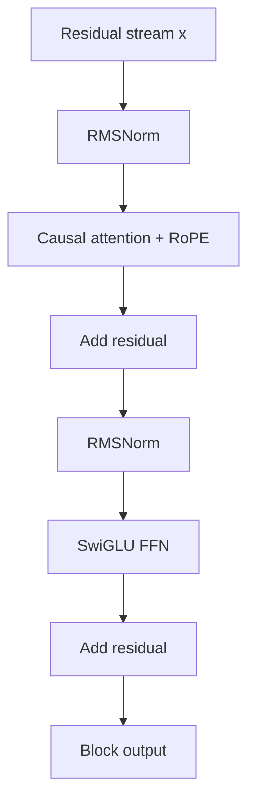
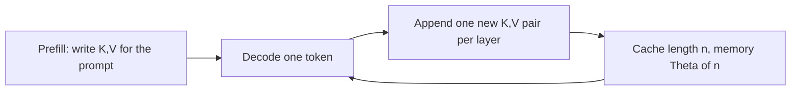
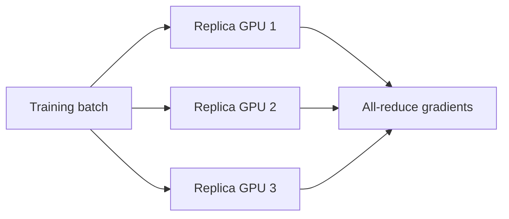
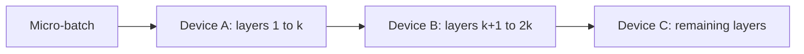
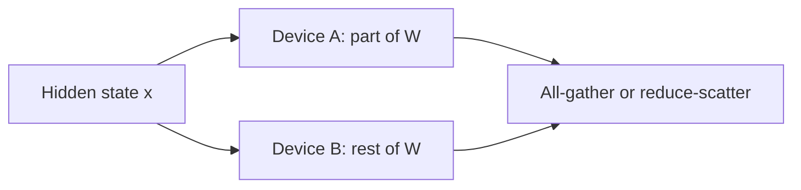

# Modern Decoder Internals and Accounting

Chapter 08 derives the 2017 Transformer. This lesson is the **LLM-era block** you will actually open in a 2024–2026 checkpoint: pre-norm RMSNorm, causal attention with RoPE, a SwiGLU feed-forward, and a KV cache at decode time. It also gives the **back-of-the-envelope arithmetic** students are expected to do in interviews: parameter count, an activation sketch, training FLOPs, and inference memory.

The 2017 algebra still holds. What changed is packaging and cost. For the neuron-level SwiGLU / RMSNorm note see **02-99**; for the original encoder–decoder walk see **08-01**; for the attention kernel story see **07-99**. This page is the hub that puts those pieces on one decoder stack.

## 1. The modern decoder block

A Llama-family layer is still “communicate, then compute,” with residuals around each sublayer. The default packaging is **pre-norm**:

### RMSNorm

LayerNorm subtracts a mean and divides by a standard deviation. **RMSNorm** ([Zhang & Sennrich, 2019](https://arxiv.org/abs/1910.07467)) drops the mean and keeps only a root-mean-square scale plus a learned gain $$\gamma$$ (no bias in the usual LLM recipe):

$$\mathrm{RMSNorm}(x) = \frac{x}{\sqrt{\frac{1}{d}\sum_{i=1}^{d} x_i^2 + \varepsilon}} \odot \gamma.$$

Why LMs switched: it is cheaper, it does not fight the residual mean, and it is what the widely copied Llama / Gemma / Qwen stacks ship. The *idea* is still “stabilize the scale of the residual stream before the next matmul” (Chapter 09).

### SwiGLU feed-forward

A 2017 FFN is $$\mathrm{ReLU}(x W_1) W_2$$. A modern gated FFN ([Shazeer, 2020](https://arxiv.org/abs/2002.05202)) is

$$\mathrm{SwiGLU}(x) = \big(\mathrm{SiLU}(x W_{\mathrm{gate}}) \odot (x W_{\mathrm{up}})\big) W_{\mathrm{down}},$$

with $$\mathrm{SiLU}(z) = z\,\sigma(z)$$ (also called Swish). Three matrices instead of two; the extra gate is the Hadamard product. Width is usually chosen so the **parameter count** stays comparable to a ReLU FFN that was $$4d$$ wide (you shrink $$d_{\mathrm{ff}}$$ when you add the third matrix). That is an accounting choice, not a new theorem.

ReLU / SiLU themselves are in **02-03** and **26-01**. Here you only need: the FFN is the block’s *position-wise* compute, and SwiGLU is the default nonlinearity packaging.

### RoPE, as a relative rotation

Absolute sin–cos positional encodings add a vector to the token embedding. **RoPE** ([Su et al., 2021/2023](https://arxiv.org/abs/2104.09864)) instead *rotates* query and key pairs in 2-D planes by an angle that depends on position $$t$$:

$$\begin{pmatrix} q_{2i} \\ q_{2i+1} \end{pmatrix}
\leftarrow
\begin{pmatrix} \cos(t\theta_i) & -\sin(t\theta_i) \\ \sin(t\theta_i) & \cos(t\theta_i) \end{pmatrix}
\begin{pmatrix} q_{2i} \\ q_{2i+1} \end{pmatrix},$$

and the same for $$k$$, with fixed frequencies $$\theta_i = \mathrm{base}^{-2i/d}$$. The inner product $$q_t^\top k_s$$ then depends on $$t-s$$, not on absolute $$t$$ and $$s$$ separately. That is the whole idea: **relative position lives in the attention score**, not as an extra added embedding. Lesson **08-99** has the same display; Chapter 08’s sin–cos PE remains the right first model.

### GQA / MQA: shrinking the cache, not the scores

Multi-head attention stores one $$K,V$$ per query head. **Multi-query** ([Shazeer, 2019](https://arxiv.org/abs/1911.02150)) shares a single $$K,V$$ across heads. **Grouped-query** ([Ainslie et al., 2023](https://arxiv.org/abs/2305.13245)) sits in between: $$n_{\mathrm{q}}$$ query heads share $$n_{\mathrm{kv}} \ll n_{\mathrm{q}}$$ key/value heads. The attention *formula* is unchanged; the **KV-cache** shrinks by about $$n_{\mathrm{kv}} / n_{\mathrm{q}}$$. That is why GQA is a serving feature as much as a training feature (lesson **26-04**).

## 2. FlashAttention as a story, not a CUDA dump

Exact attention is still $$\mathrm{softmax}(QK^\top / \sqrt{d})\,V$$. The naive implementation materializes the $$L\times L$$ score matrix in GPU HBM. [Dao et al., 2022](https://arxiv.org/abs/2205.14135) (**FlashAttention**) never stores that full matrix: they **tile** $$Q,K,V$$ into SRAM-sized blocks and fuse the softmax with the value multiply.

Softmax over a long row is not a local operation — you need the sum of exponentials. The trick is the same **online / streaming softmax** already named in **26-01**: keep a running max $$m$$ and a running sum $$s$$ of $$e^{z-m}$$ as tiles arrive, and *rescale* the partial weighted sum of $$V$$ whenever $$m$$ grows. The output is algebraically the same softmax; the IO is much smaller.

You do **not** need the kernel schedule to use the idea. Remember three sentences: (1) attention is IO-bound at LLM sizes; (2) tiling plus online softmax removes the $$L\times L$$ write; (3) the numerics are the stable log-sum-exp story, not a new score function. FlashAttention-2/3 improve parallelism and hardware mapping ([Dao, 2023](https://arxiv.org/abs/2307.08691); [Shah et al., 2024](https://arxiv.org/abs/2407.08608)). Pointer back to **07-99**.

## 3. Accounting students can actually compute

No invented model cards here — only the **order-of-magnitude** identities used in Kaplan-style notes and in interviews. Plug in *your* $$n_{\mathrm{layers}}$$, $$d$$, $$V$$, $$L$$.

### Parameter count (dense decoder)

A first sketch, ignoring biases and MoE:

$$
\begin{aligned}
N_{\mathrm{embed}} &\approx 2\, V d
\quad \text{(token table + untied LM head; drop a } Vd \text{ if weights are tied)}, \\
N_{\mathrm{attn}} &\approx n_{\mathrm{layers}}\big( d\cdot d_{\mathrm{q}} + 2\, d\cdot d_{\mathrm{kv}} + d_{\mathrm{q}}\cdot d \big), \\
N_{\mathrm{ffn}} &\approx n_{\mathrm{layers}}\cdot 3\, d\, d_{\mathrm{ff}}
\quad \text{(SwiGLU: gate, up, down)}.
\end{aligned}
$$

For multi-head, $$d_{\mathrm{q}} = n_{\mathrm{q}} d_{\mathrm{head}}$$ and $$d_{\mathrm{kv}} = n_{\mathrm{kv}} d_{\mathrm{head}}$$. Full MHA means $$n_{\mathrm{kv}} = n_{\mathrm{q}}$$ and the attention term is about $$4 n_{\mathrm{layers}} d^2$$. GQA replaces two of those $$d^2$$ blocks by $$d\cdot d_{\mathrm{kv}}$$. Embeddings dominate only at small $$d$$ or huge $$V$$; at typical LLM width the **layers** dominate.

### Activation sketch (training)

Forward activations you must keep for the backward pass scale as

$$n_{\mathrm{layers}} \times B \times L \times d$$

plus attention maps if they are not recomputed. Checkpointing (rematerialization) trades extra FLOPs for a smaller activation footprint. This is why **micro-batch size** and **sequence length** hit memory before the weight tensors do.

### FLOPs, order of magnitude

A dense matmul of an $$n\times m$$ weight with a length-$$L$$ batch of tokens costs about $$2 n m L$$ FLOPs (multiply-add). Summing over the whole network, the usual first-order statement ([Kaplan et al., 2020](https://arxiv.org/abs/2001.08361)) is:

$$
\begin{aligned}
C_{\mathrm{fwd}} &\approx 2\, N_{\mathrm{params}}\, T, \\
C_{\mathrm{bwd}} &\approx 2\, C_{\mathrm{fwd}} \approx 4\, N_{\mathrm{params}}\, T, \\
C_{\mathrm{train}} &\approx 6\, N_{\mathrm{params}}\, T,
\end{aligned}
$$

where $$T$$ is the number of **tokens** (batch $$\times$$ sequence, summed over steps). Attention’s $$O(L^2 d)$$ term is ignored in this sketch; it matters at very long $$L$$, not in the first interview answer. Backward $$\approx 2\times$$ forward is the same “one extra matmul per weight for the input gradient, one for the weight gradient” picture from Chapter 03.

### Inference memory

At decode time you are not storing a training graph. The resident set is essentially

$$\mathrm{mem} \approx \underbrace{N_{\mathrm{params}} \cdot b_{\mathrm{w}}}_{\text{weights}} + \underbrace{2 \cdot L \cdot n_{\mathrm{layers}} \cdot n_{\mathrm{kv}} \cdot d_{\mathrm{head}} \cdot b_{\mathrm{kv}}}_{\text{KV cache}},$$

with $$b_{\mathrm{w}}$$ and $$b_{\mathrm{kv}}$$ the bytes per element (2 for fp16, 1 for int8, …). The factor 2 is keys and values. **This grows linearly in the cached length $$L$$** — that is the picture in **26-04**. Quantization shrinks the first term; GQA shrinks the second.

## 4. Scaling laws, qualitatively (Chinchilla-style)

[Kaplan et al., 2020](https://arxiv.org/abs/2001.08361) showed that, over a wide range, pretraining loss falls as a power law in model size, dataset size, and compute, and that **under a fixed compute budget** it paid to grow parameters faster than tokens. [Hoffmann et al., 2022](https://arxiv.org/abs/2203.15556) (*Training Compute-Optimal Large Language Models*, the **Chinchilla** paper) re-fit the same kind of isoFLOP curves with a different protocol and concluded the opposite allocation: **for a given training-FLOP budget, scale parameters and tokens together** — many then-popular models were *undertrained* (too big for the number of tokens they saw).

What you should take, without treating any one fitted exponent as a law of nature:

- Compute $$C \approx 6 N T$$ is the budget you are splitting between $$N$$ and $$T$$.
- “Compute-optimal” means: choose $$(N, T)$$ on that isoFLOP curve so that the *loss* is smallest, not so that the *model* is largest.
- Hoffmann et al. found that compute-optimal training in their setup used **on the order of tens of tokens per parameter**. That is a published fit, not a universal constant; later LMs often train *past* that point because inference cost favors a smaller $$N$$ that read more tokens.
- Chapter 25 surveys the research landscape; this lesson only states the **train-time** trade. Test-time compute (25-99) is a different axis.

Do not quote a loss number or a parameter count you did not measure or read off a paper table.

## 5. RNN / LSTM vs Transformer (and one paragraph on SSMs)

| | RNN / LSTM (Ch. 05–06) | Transformer decoder (Ch. 08, this lesson) |
| --- | --- | --- |
| State | A hidden vector $$h_t$$ updated from $$h_{t-1}$$ | The whole prefix, mixed by attention |
| Parallelism in $$t$$ | Sequential: step $$t$$ needs $$t-1$$ | Training: all positions in the window at once |
| Path length | $$O(L)$$ steps between distant tokens | $$O(1)$$ attention hop (inside the window) |
| Decode cost | $$O(1)$$ state update per new token | $$O(L)$$ attend-to-cache per new token |
| Long range | LSTMs help vanishing gradients; they do not give global mixing | Global inside $$L$$; cost is the KV cache and $$L^2$$ prefill |

An LSTM gate is a *learned* write/forget of a fixed-size cell. Attention is a *content-addressed* read of every cached key. That is the interview contrast. Transformers won pretraining throughput (parallel $$t$$) and in-context mixing; RNNs stay cheap per generated token because the state does not grow.

**State-space models (SSMs), one paragraph.** Linear recurrences such as S4 and Mamba ([Gu & Dao, 2023](https://arxiv.org/abs/2312.00752)) replace the attention mixer by a structured state that *can* be computed as a convolution in training and as an $$O(1)$$-state step in decode — RNN-like inference cost with Transformer-like training parallelism. They are a real alternative sequence mixer, not “a small LSTM.” This course does not derive the HiPPO / selective-scan algebra; if you meet an SSM paper, ask: *what is the state, and is the train path a convolution or a scan?* Then come back to the decoder block above, which is still the default LLM.

## 6. Appendix: three parallelism pictures

These diagrams are the vocabulary of a training cluster, not a Megatron tutorial. Each shard is one idea.

**Data parallelism** — replicate the whole model; split the batch.

**Pipeline parallelism** — split *layers* across devices; a micro-batch walks the pipeline.

**Tensor parallelism** — split *one* matmul (or one attention head group) across devices.

Real stacks mix all three (and ZeRO / FSDP, which shard *optimizer state* as well). You only need to name which axis is being split: batch, depth, or width. Chapter 23’s efficiency tools (quantization, distillation) are complementary: they change $$N$$ or bits, not how a cluster cuts a step.

## 7. Where this sits in the hub

- **26-01** — CE / softmax / Adam refresh that this block’s last layer uses.
- **26-04** — KV-cache bytes, batching, speculative decoding, sampling.
- **08-01 / 08-99** — full 2017 derivation and the first RoPE display.
- **07-99** — FlashAttention citations and PagedAttention.
- **25 / 25-99** — broader scaling and test-time compute.

## Further reading

Inspiration and topic map only — **not** a source to quote. Rewrite was done in this course’s voice; diagrams above are original Mermaid.

- Alisa Liu, *[Alisa’s Book of LLMs](https://alisawuffles.notion.site/alisa-s-book-of-llms)* (public study notes).
- Alisa Liu, *[Math notes](https://alisawuffles.notion.site/math-notes)* (same author; fetch is often empty as a Notion SPA — use the URL as a pointer).
- Kaplan et al., 2020. [Scaling Laws for Neural Language Models](https://arxiv.org/abs/2001.08361).
- Hoffmann et al., 2022. [Training Compute-Optimal Large Language Models](https://arxiv.org/abs/2203.15556).
- Vaswani et al., 2017. [Attention Is All You Need](https://arxiv.org/abs/1706.03762).
- Su et al., 2023. [RoFormer / RoPE](https://arxiv.org/abs/2104.09864).
- Zhang & Sennrich, 2019. [RMSNorm](https://arxiv.org/abs/1910.07467).
- Shazeer, 2020. [GLU Variants Improve Transformer](https://arxiv.org/abs/2002.05202).
- Dao et al., 2022. [FlashAttention](https://arxiv.org/abs/2205.14135).
- Ainslie et al., 2023. [GQA](https://arxiv.org/abs/2305.13245).
- Gu & Dao, 2023. [Mamba](https://arxiv.org/abs/2312.00752).

## Key takeaways

- Modern decoder layer = RMSNorm → causal attention + RoPE → residual → RMSNorm → SwiGLU → residual.
- GQA / MQA cut **cache heads**, not the softmax formula. FlashAttention cuts **IO**, not the math.
- Forward FLOPs $$\sim 2 N T$$; backward $$\sim 2\times$$ that; train $$\sim 6 N T$$. Inference memory $$\approx$$ weights + KV.
- Chinchilla-style optimality: split a FLOP budget across **both** $$N$$ and $$T$$. Cite Kaplan and Hoffmann; do not invent a loss curve.
- RNNs compress the past into $$h_t$$; Transformers reread a cache of size $$O(L)$$. SSMs try to get both.
