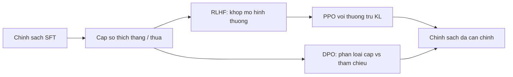

# Căn chỉnh: SFT đến tối ưu sở thích

Tiền huấn luyện dạy *văn bản trông như thế nào*. SFT dạy *cách trả lời một yêu cầu*. **Căn chỉnh** (*alignment*) ở đây là bước tiếp: trong nhiều câu trả lời trôi chảy, ưa những câu mà người (hoặc AI) đánh giá sẽ xếp cao hơn — hữu ích, ít hại, đủ trung thực cho sản phẩm.

Bài này là **bản đồ**, không phải khóa RL thứ hai. MDP, advantage, và toán PPO nằm ở Chương 20–21; stack sản phẩm 2022–2026 nằm ở **21-99**. Đọc những bài đó nếu bạn cần suy diễn. Ở đây ta chỉ đặt các giai đoạn vào pipeline LLM.

## 1. Bức tranh ba giai đoạn thông thường

```
LM tiền huấn luyện  →  SFT (minh họa)  →  tối ưu sở thích
```

**Giai đoạn A — SFT.** Thu thập cặp (prompt, minh họa). Cực tiểu hóa loss token kế trên các token minh họa. Bạn đã gặp bước này ở **26-02**. SFT là học có giám sát thông thường trên một phân bố đã tuyển.

**Giai đoạn B — mô hình sở thích (RLHF cổ điển).** Thu thập cặp $$(y_w, y_l)$$ cho cùng prompt: bản *thắng* và bản *thua*. Huấn luyện mô hình thưởng $$r_\phi$$ sao cho $$r_\phi(x, y_w) > r_\phi(x, y_l)$$, thường với loss Bradley–Terry / logistic. Rồi coi LM như chính sách $$\pi_\theta$$ phát token (hành động) và tối ưu thưởng kỳ vọng với **phạt KL** về phía mô hình SFT tham chiếu, để chính sách không trôi vào văn bản rác đánh lừa $$r_\phi$$.

[Ouyang et al., 2022](https://arxiv.org/abs/2203.02155) (InstructGPT) phổ biến vòng này với PPO. Chương 21 đã có actor–critic; **21-99** viết phiên bản LM.

**Giai đoạn C — tối ưu sở thích không vòng lấy mẫu.** [Rafailov et al., 2023](https://arxiv.org/abs/2305.18290) (DPO) viết lại cực tiểu RL có ràng buộc thành loss phân loại trên cùng các cặp $$(y_w, y_l)$$, so $$\pi_\theta$$ với tham chiếu đóng băng $$\pi_{\mathrm{ref}}$$. Không mô hình thưởng và không bộ lấy mẫu PPO lúc huấn luyện. Các stack nguồn mở (ví dụ [trl](https://github.com/huggingface/trl)) khiến đây thành công thức mặc định cho nhiều mô hình instruct 2024–2025.

Mục tiếp theo viết **các mục tiêu mức cao** để bạn đọc được tóm tắt bài báo. Bạn **không** cần suy diễn lại DPO ở đây. Nhớ hợp đồng:

$$\text{SFT cố định phần đỡ (loại câu trả lời tồn tại); sở thích đánh trọng số lại phần đỡ đó.}$$

Nếu dữ liệu SFT không bao giờ hiện từ chối, trích dẫn, hay gọi công cụ, huấn luyện sở thích không thể bịa các kỹ năng đó chỉ từ một số vô hướng “hơn/kém.”

## 2. Các mục tiêu bạn cần viết được (không phải biến thể tối nghĩa)

Coi LM như chính sách $$\pi_\theta(y\mid x)$$ phát chuỗi token $$y$$ cho prompt $$x$$. Toán PPO / advantage đầy đủ ở lại Chương 20–21; **21-99** là bản tóm tắt hình LM. Ta bỏ các họ có tên (IPO, KTO, ORPO, …) trừ khi bạn tự mở những bài đó.

**Policy gradient (dạng REINFORCE).** Một lợi tức hoặc advantage $$\hat{A}$$ nhân hàm điểm:

$$\nabla_\theta J(\theta) \approx \mathbb{E}_{x,y\sim\pi_\theta}\big[\,\hat{A}(x,y)\,\nabla_\theta \log\pi_\theta(y\mid x)\,\big].$$

Với LM tự hồi quy, $$\log\pi_\theta(y\mid x) = \sum_t \log\pi_\theta(y_t\mid x, y_{<t})$$ — cùng tổng như NLL của SFT, với *trọng số* $$\hat{A}$$ thay vì “luôn 1.”

**RLHF như thưởng có regularize KL.** Sau khi khớp mô hình thưởng $$r_\phi$$ trên các cặp, mục tiêu thông thường ([Ouyang et al., 2022](https://arxiv.org/abs/2203.02155)) là

$$\max_\theta\; \mathbb{E}_{x\sim\mathcal{D},\, y\sim\pi_\theta}\big[r_\phi(x,y)\big] - \beta\,\mathrm{KL}\big(\pi_\theta(\cdot\mid x)\,\|\,\pi_{\mathrm{ref}}(\cdot\mid x)\big).$$

Số hạng KL là lý do chính sách không sụp thành phương ngữ đánh lừa $$r_\phi$$ mà người không thích. $$\pi_{\mathrm{ref}}$$ thường là checkpoint SFT.

**PPO clip (bộ tối ưu, không phải sản phẩm).** PPO ([Schulman et al., 2017](https://arxiv.org/abs/1707.06347)) cực đại hóa surrogate *cắt* trên tỉ số xác suất $$r_t(\theta) = \pi_\theta(a_t\mid s_t)/\pi_{\mathrm{old}}(a_t\mid s_t)$$:

$$L^{\mathrm{CLIP}}(\theta) = \mathbb{E}\Big[\min\big(r_t(\theta)\,\hat{A}_t,\; \mathrm{clip}(r_t(\theta), 1-\varepsilon, 1+\varepsilon)\,\hat{A}_t\big)\Big].$$

Trong LM, $$a_t$$ là một token và $$s_t$$ là tiền tố. InstructGPT dùng vòng này; nó đắt (bộ lấy mẫu, thường có đầu value, bất ổn).

**DPO (sở thích không bộ lấy mẫu).** [Rafailov et al., 2023](https://arxiv.org/abs/2305.18290) giải bài toán regularize KL dạng đóng và được loss *phân loại* trên cùng các cặp $$(y_w, y_l)$$:

$$\mathcal{L}_{\mathrm{DPO}}(\theta) = -\log\sigma\Big(\beta\log\frac{\pi_\theta(y_w\mid x)}{\pi_{\mathrm{ref}}(y_w\mid x)} - \beta\log\frac{\pi_\theta(y_l\mid x)}{\pi_{\mathrm{ref}}(y_l\mid x)}\Big).$$

Trực giác: nâng khoảng thưởng ẩn giữa bản thắng và bản thua, đo bằng log-odds *so với tham chiếu*. Không $$r_\phi$$ và không rollout PPO lúc huấn luyện. Đó là hợp đồng; suy diễn nằm trong bài báo và ở **21-99**.



## 3. Căn chỉnh *không* phải là gì

- **Không thay truy hồi.** Sở thích không thêm sự kiện chưa từng có trong tiền huấn luyện hay trong prompt (Chương 18-99).
- **Không phải chứng minh an toàn đầy đủ.** Người đánh giá mã hóa một chính sách; họ không chứng nhận độ bền. Jailbreak và lệch phân bố vẫn là bài toán đánh giá.
- **Không chỉ là RL.** RLHF là một cách cài. DPO, các loss theo cặp khác, và cả pipeline chỉ-SFT cẩn thận đều là căn chỉnh *theo nghĩa sản phẩm*.
- **Không trùng chưng cất.** Chưng cất chép hành vi giáo viên vào học sinh nhỏ hơn (**26-05**). Căn chỉnh đổi *hành vi nào* được ưa. Bạn có thể chưng cất một giáo viên đã căn chỉnh; đó là cách phổ biến cho các tầng sản phẩm nhỏ.

## 4. Phác thảo tự học bạn có thể vẽ trên giấy

Với một prompt $$x$$:

1. Lấy mẫu hoặc viết hai bản hoàn thiện $$y_1, y_2$$ từ mô hình SFT.
2. Người đánh giá đánh dấu $$y_w \succ y_l$$.
3. *Đường RLHF:* khớp $$r_\phi$$; chạy PPO trên $$\pi_\theta$$ với thưởng $$r_\phi - \beta \log(\pi_\theta/\pi_{\mathrm{ref}})$$.
4. *Đường DPO:* đẩy lên $$\log\pi_\theta(y_w\mid x)$$ so với $$\log\pi_\theta(y_l\mid x)$$, chỉnh theo cùng các log dưới $$\pi_{\mathrm{ref}}$$.

Nếu bạn giải thích được vì sao số hạng KL / tham chiếu tồn tại (reward hacking, sụp phong cách), bạn sẵn sàng cho Chương 21-99. Nếu chỉ cần câu chuyện sản phẩm, dừng ở đây.

## 5. Đi tiếp ở đâu trong khóa này

- **Chương 20–21** — trạng thái, hành động, lợi tức, PPO.
- **21-99** — RLHF, DPO, GRPO cho mô hình lý luận.
- **26-04** — phục vụ chính sách đã căn chỉnh với chi phí thấp.
- **26-05** — thu nhỏ giáo viên đã căn chỉnh mà không thu thập sở thích lại từ đầu.

## Đọc thêm

- Ouyang et al., 2022. [Training language models to follow instructions with human feedback](https://arxiv.org/abs/2203.02155) (InstructGPT / RLHF + PPO).
- Schulman et al., 2017. [Proximal Policy Optimization Algorithms](https://arxiv.org/abs/1707.06347).
- Rafailov et al., 2023. [Direct Preference Optimization](https://arxiv.org/abs/2305.18290).
- Cảm hứng bản đồ chủ đề (không trích): [Alisa’s Book of LLMs](https://alisawuffles.notion.site/alisa-s-book-of-llms).

## Điểm chính cần nhớ

- Căn chỉnh trong chương này = SFT rồi đánh trọng số lại theo sở thích.
- Viết được ba dòng: policy gradient $$\hat{A}\nabla\log\pi$$; RLHF = thưởng trừ $$\beta\,\mathrm{KL}$$ về tham chiếu; PPO cắt tỉ số xác suất.
- DPO là cùng cực tiểu regularize KL dưới dạng loss logistic trên $$(y_w, y_l)$$ — không mô hình thưởng lúc huấn luyện.
- Kỹ năng đến từ dữ liệu (và công cụ); sở thích xếp hạng kỹ năng bạn đã có.
- Suy diễn RL đầy đủ ở lại Chương 20–21 — đừng nhân bản ở đây.
