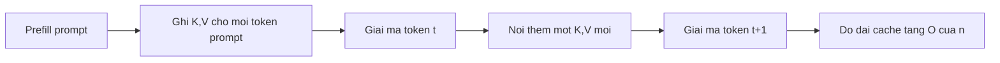
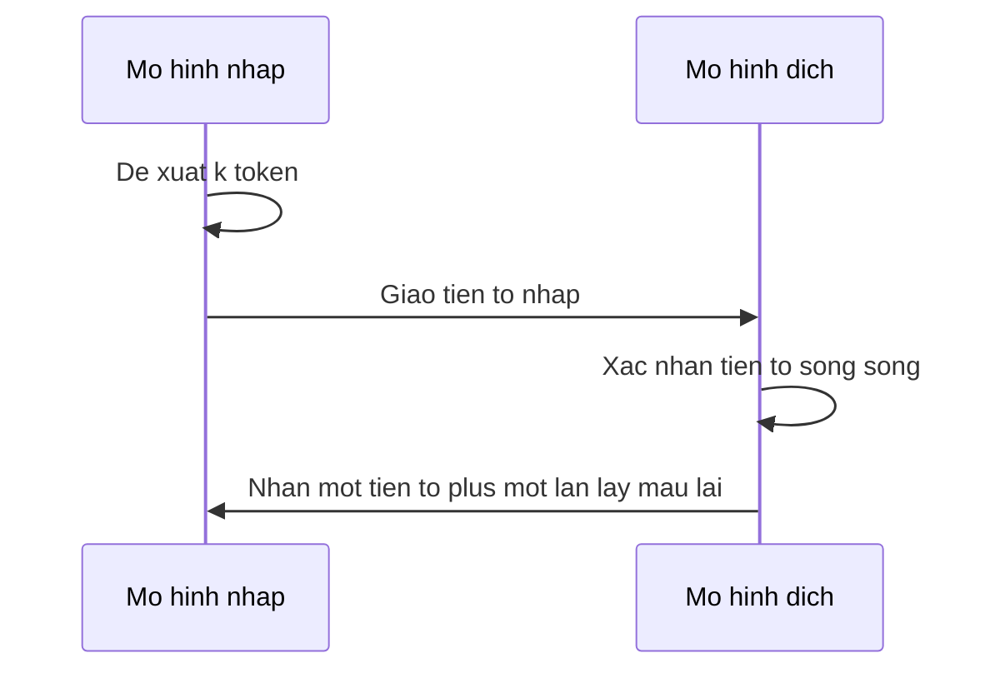

# Phục vụ và hiệu năng cho LLM

Một decoder đã tiền huấn luyện, đã dạy chỉ dẫn, đã căn chỉnh vẫn đắt **theo từng token sinh ra**. Huấn luyện là hóa đơn một lần (hoặc hiếm); phục vụ là hóa đơn tăng theo người dùng. Bài này liệt kê các nút bạn nên gọi tên trước khi với tới chưng cất.

Toán nén — lưới lượng tử, điểm cắt tỉa, KD cổ điển — ở lại **Chương 23**. Các công thức riêng cho LLM (GPTQ, AWQ, GGUF, speculative decoding) ở **23-99**. Ở đây ta chỉ trả lời: *thứ gì đắt lúc giải mã, và khi nào học sinh nhỏ hơn là bước đúng tiếp theo?*

## 1. Prefill so với decode

Sinh tự hồi quy có hai pha:

**Prefill.** Toàn bộ prompt (hệ thống + lịch sử + người dùng + văn bản truy hồi) được tiêu thụ song song. Bạn trả attention trên độ dài prompt một lần và ghi **KV-cache**: với mỗi tầng và mỗi token prompt, lưu vector key và value.

**Decode.** Bạn phát từng token mới một. Không cache, bạn sẽ tính lại attention từ đầu trên tiền tố đang dài (xấp xỉ $$O(t^2)$$ tại bước $$t$$). Có cache, bạn append một $$k,v$$ mới và attention trên tiền tố đã lưu — khoảng $$O(t)$$ công attention mỗi token mới, cộng MLP.

Đó chính là KV-cache đã được nêu ở **08-99**. Hệ phục vụ (vLLM, SGLang, llama.cpp) chủ yếu là: *quản nhiều cache, gom nhân ma trận, và chồng I/O*.

Bộ nhớ, không chỉ FLOP, thường chiếm ưu thế. Cache cho một hội thoại dài là

$$\mathrm{bytes} \approx 2 \cdot L \cdot n_{\mathrm{layers}} \cdot n_{\mathrm{kv\_heads}} \cdot d_{\mathrm{head}} \cdot b$$

(hệ số 2 là key và value; $$b$$ là số byte mỗi phần tử; grouped-query attention thu nhỏ $$n_{\mathrm{kv\_heads}}$$). Đó là lý do ngữ cảnh dài là quyết định **sản phẩm**, không chỉ quyết định chất lượng.

GQA / MQA (**26-07**, **07-99**) thu $$n_{\mathrm{kv\_heads}}$$. FlashAttention **không** thu cache; nó thu IO khi tính attention trên cache đó (lát + softmax trực tuyến, **26-01** / **26-07**). FLOPs huấn luyện theo thứ tự độ lớn và đồng nhất bộ nhớ “trọng số + KV” nằm ở **26-07**.

## 2. Gom batch và đóng gói

Một bước decode là matmul gầy: batch 1, chuỗi 1, trọng số khổng lồ. GPU muốn matmul béo. **Continuous batching** (lịch theo vòng lặp; hình vLLM) giữ thiết bị bận bằng cách nhận request mới khi request khác vừa xong chuỗi, thay vì chờ một batch tĩnh kết thúc. **Đóng gói chuỗi** là anh em lúc huấn luyện: nối các tài liệu ngắn trong một cửa sổ và mask để token không attention sang tài liệu khác. Cùng ý — đừng trả tiền cho padding bạn sẽ bỏ qua.

Prefill của system prompt dùng chung có thể tính một lần và **cache tiền tố**. Đó là gom batch theo thời gian chứ không theo người dùng.

## 3. Lấy mẫu: nhiệt độ, top-$$k$$, top-$$p$$

Giải mã không phải lúc nào cũng $$\arg\max$$. Cho logit $$z$$,

$$p_i^{(T)} = \frac{\exp(z_i / T)}{\sum_j \exp(z_j / T)}.$$

$$T \to 0$$ là tham lam; $$T = 1$$ là phân bố đã huấn luyện; $$T > 1$$ làm phẳng (nhiều bất ngờ hơn, nhiều vỡ hơn). **Top-$$k$$** đưa mọi logit ngoài $$k$$ lớn nhất về không, rồi chuẩn hóa lại. **Nucleus / top-$$p$$** ([Holtzman et al., 2020](https://arxiv.org/abs/1904.09751)) giữ *tập nhỏ nhất* các token có xác suất tích lũy ít nhất $$p$$, rồi chuẩn hóa lại. Nhiệt độ đổi *hình dạng*; top-$$k$$ / top-$$p$$ đổi *phần đỡ*. Chúng kết hợp: chia cho $$T$$, cắt, rồi lấy mẫu.

Đừng nhầm $$T$$ này với nhiệt độ chưng cất ở **26-05**. Cùng đại số; việc khác (độ đa dạng lúc giải mã vs giáo viên mềm).

## 4. Speculative decoding (nháp + xác nhận)

[Leviathan et al., 2023](https://arxiv.org/abs/2211.17192) (và các bài song song) dùng một mô hình **nháp** rẻ để đề xuất vài token; mô hình **đích** lớn xác nhận tiền tố đó trong một lượt forward song song. Token mà đích sẽ lấy mẫu thì được nhận; tại chỗ bất đồng đầu tiên bạn lấy mẫu lại từ phân bố đích *đã chỉnh* và bỏ phần nháp còn lại. Cài đúng thì luật đầu ra là của đích, không của nháp. Bạn tốn thêm FLOP nháp để mua ít lượt forward đích hơn.

Đây là mẹo *phục vụ*, không phải học sinh mới được huấn luyện. Nếu bạn cần kiến trúc nhỏ hơn, đó là chưng cất (**26-05**).

## 5. Lượng tử hóa là thắng lợi rẻ đầu tiên

Lưu trọng số 16-bit thay vì 32-bit, rồi 8-bit hoặc 4-bit, cắt bộ nhớ và có thể cắt thời gian decode bị giới hạn băng thông. Chương 23 cho hình dung làm tròn; **23-99** gọi tên GPTQ / AWQ / GGUF như các công thức người ta thực sự chạy trên decoder 7B–70B.

Lượng tử hóa **không** huấn luyện mô hình mới. Nó xấp xỉ cùng $$\theta$$ bằng ít bit hơn. Dùng khi:

- bạn sở hữu hoặc được phép phân phối checkpoint đó,
- sụt chất lượng chấp nhận được sau một vòng đánh giá nhanh,
- bạn cần *cùng* hành vi với RAM thấp hơn (laptop, một GPU, biên).

Nếu 4-bit vẫn trượt mục tiêu độ trễ hoặc chi phí, bạn cần ít tầng/độ rộng hơn hoặc ít tham số kích hoạt hơn (định tuyến MoE — cũng ở 23-99) — hoặc một **học sinh**.

## 6. Các đòn bẩy phục vụ khác (để không quá thiên về chưng cất)

- **Cache prompt / chia sẻ tiền tố.** Nhiều request chung system prompt; tái sử dụng prefill đó (mục 2).
- **Truy hồi vs ngữ cảnh dài.** Nhét cả cuốn sách vào $$L$$ thường chậm hơn và kém hơn truy hồi (18-99).
- **Adapter (LoRA / QLoRA).** Chuyên biệt hóa mà không phục vụ thêm một bản sao đầy đủ cho mọi chuyên gia (Chương 15 tùy chọn).
- **Sổ sách.** Nếu cần $$N$$, cỡ activation, hoặc $$C \approx 6NT$$, mở **26-07** chứ đừng đoán.

Không mục nào *chuyển tri thức vào một kiến trúc nhỏ hơn*. Chúng làm giáo viên rẻ hơn khi chạy.

## 7. Khi nào nên chưng cất

Với tới chưng cất (**26-05**) khi ít nhất một điều sau đúng:

1. **Kiến trúc phải thu nhỏ.** Lượng tử hóa không xóa được tầng. Giáo viên 70B phải thành học sinh 7–8B (hoặc mobile) cần một $$\theta$$ mới.
2. **Bạn muốn tầng sản phẩm rẻ hơn** với *hành vi* tương tự, không phải bản sao bit-exact — trong nhà, trên giáo viên bạn được phép huấn luyện từ đó.
3. **Bạn sẽ tinh chỉnh nhiều chuyên gia.** Chưng cất một học sinh tổng quát một lần, rồi LoRA từng chuyên gia.
4. **Nội tại hộp trắng sẵn có** và bạn muốn khớp hidden state hoặc phân bố token, không chỉ văn bản.

**Đừng** chưng cất trước nếu chưa thử trọng số 4-bit, giới hạn ngữ cảnh hợp lý, và gom batch. Chưng cất là dự án huấn luyện; lượng tử hóa thường chỉ là một cờ chuyển đổi.

Cũng đừng chưng cất giáo viên mà bạn không được cấp phép hoặc không có hợp đồng để huấn luyện từ đó. Bài sau tách chưng cất trong nhà / giấy phép mở thông thường khỏi việc gặt một API bạn không kiểm soát.

## Đọc thêm

- Leviathan et al., 2023. [Fast Inference from Transformers via Speculative Decoding](https://arxiv.org/abs/2211.17192).
- Holtzman et al., 2020. [The Curious Case of Neural Text Degeneration](https://arxiv.org/abs/1904.09751) (nucleus sampling).
- Kwon et al., 2023. [Efficient Memory Management for Large Language Model Serving with PagedAttention](https://arxiv.org/abs/2309.06180).
- Cảm hứng bản đồ chủ đề (không trích): [Alisa’s Book of LLMs](https://alisawuffles.notion.site/alisa-s-book-of-llms).

## Điểm chính cần nhớ

- Chi phí decode = MLP + attention trên **KV-cache** đang lớn dần (bộ nhớ $$O(n)$$ theo độ dài đã cache).
- Continuous batching / đóng gói lấp GPU; speculative decoding là nháp + xác nhận song song.
- Nhiệt độ đổi hình $$p$$; top-$$k$$ / top-$$p$$ cắt phần đỡ. Cùng đại số $$T$$ với KD, việc khác.
- Lượng tử hóa và gom batch là công cụ hiệu năng mặc định (Chương 23 / 23-99).
- Chưng cất là công cụ cho một mạng *mới, nhỏ hơn* *bắt chước* giáo viên.
- Quyết định “cache / lượng tử / truy hồi” trước “huấn luyện học sinh.”
