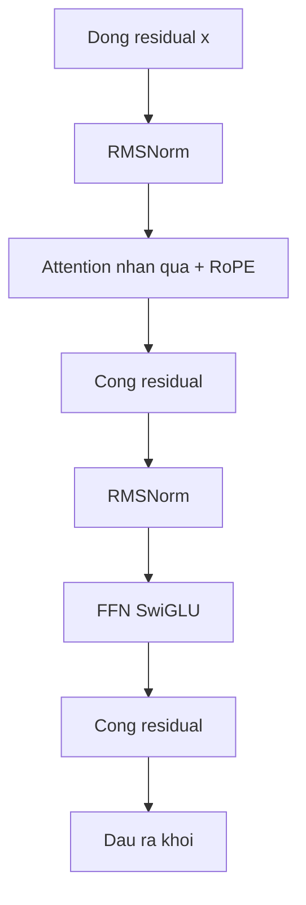
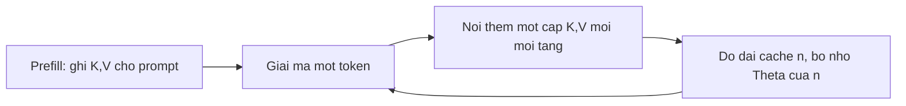
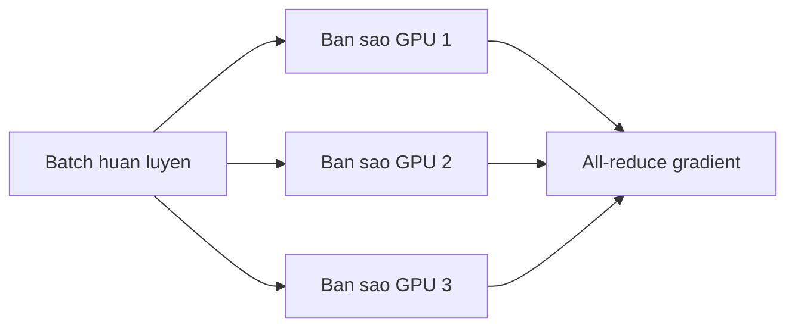
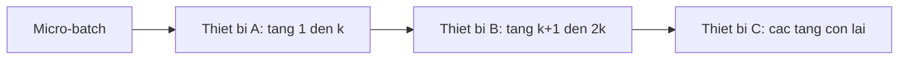
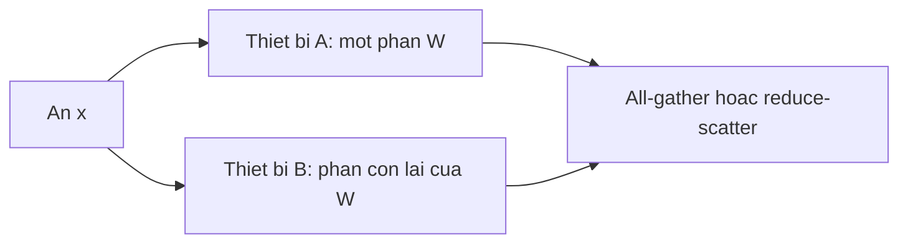

# Nội tại decoder hiện đại và sổ sách chi phí

Chương 08 suy diễn Transformer 2017. Bài này là **khối thời LLM** bạn sẽ thực sự mở trong checkpoint 2024–2026: RMSNorm tiền chuẩn hóa, attention nhân quả với RoPE, FFN SwiGLU, và KV-cache lúc giải mã. Nó cũng cho **số học ước lượng** mà phỏng vấn thường hỏi: đếm tham số, phác activation, FLOPs huấn luyện, và bộ nhớ suy luận.

Đại số 2017 vẫn đúng. Thứ đổi là cách đóng gói và chi phí. Ghi chú neuron-level về SwiGLU / RMSNorm ở **02-99**; đi bộ encoder–decoder gốc ở **08-01**; câu chuyện kernel attention ở **07-99**. Trang này là hub đặt những mảnh đó lên một stack decoder.

## 1. Khối decoder hiện đại

Một tầng họ Llama vẫn là “giao tiếp, rồi tính,” với residual quanh mỗi nhánh con. Đóng gói mặc định là **pre-norm**:

### RMSNorm

LayerNorm trừ trung bình rồi chia độ lệch chuẩn. **RMSNorm** ([Zhang & Sennrich, 2019](https://arxiv.org/abs/1910.07467)) bỏ trung bình, chỉ giữ một thang root-mean-square cộng gain học được $$\gamma$$ (thường không có bias trong công thức LLM):

$$\mathrm{RMSNorm}(x) = \frac{x}{\sqrt{\frac{1}{d}\sum_{i=1}^{d} x_i^2 + \varepsilon}} \odot \gamma.$$

Vì sao LM chuyển: rẻ hơn, không đánh nhau với trung bình residual, và đó là thứ các stack Llama / Gemma / Qwen sao chép rộng rãi. *Ý tưởng* vẫn là “ổn định thang của dòng residual trước matmul kế” (Chương 09).

### FFN SwiGLU

FFN 2017 là $$\mathrm{ReLU}(x W_1) W_2$$. FFN có cổng hiện đại ([Shazeer, 2020](https://arxiv.org/abs/2002.05202)) là

$$\mathrm{SwiGLU}(x) = \big(\mathrm{SiLU}(x W_{\mathrm{gate}}) \odot (x W_{\mathrm{up}})\big) W_{\mathrm{down}},$$

với $$\mathrm{SiLU}(z) = z\,\sigma(z)$$ (còn gọi Swish). Ba ma trận thay vì hai; cổng thêm là tích Hadamard. Độ rộng thường được chọn để **số tham số** còn tương đương FFN ReLU rộng $$4d$$ (bạn thu $$d_{\mathrm{ff}}$$ khi thêm ma trận thứ ba). Đó là lựa chọn sổ sách, không phải định lý mới.

Bản thân ReLU / SiLU nằm ở **02-03** và **26-01**. Ở đây bạn chỉ cần: FFN là phần tính *theo vị trí* của khối, và SwiGLU là đóng gói phi tuyến mặc định.

### RoPE, như một phép quay tương đối

Mã hóa vị trí sin–cos tuyệt đối cộng một vector vào embedding token. **RoPE** ([Su et al., 2021/2023](https://arxiv.org/abs/2104.09864)) thay vào đó *quay* các cặp query và key trên mặt phẳng 2-D một góc phụ thuộc vị trí $$t$$:

$$\begin{pmatrix} q_{2i} \\ q_{2i+1} \end{pmatrix}
\leftarrow
\begin{pmatrix} \cos(t\theta_i) & -\sin(t\theta_i) \\ \sin(t\theta_i) & \cos(t\theta_i) \end{pmatrix}
\begin{pmatrix} q_{2i} \\ q_{2i+1} \end{pmatrix},$$

và tương tự cho $$k$$, với tần số cố định $$\theta_i = \mathrm{base}^{-2i/d}$$. Tích trong $$q_t^\top k_s$$ khi đó phụ thuộc $$t-s$$, không phụ thuộc $$t$$ và $$s$$ tuyệt đối riêng rẽ. Đó là toàn bộ ý: **vị trí tương đối sống trong điểm attention**, không phải embedding cộng thêm. Bài **08-99** có cùng phép quay; PE sin–cos của Chương 08 vẫn là mô hình đầu đúng.

### GQA / MQA: thu cache, không thu công thức điểm

Multi-head attention lưu một $$K,V$$ cho mỗi query head. **Multi-query** ([Shazeer, 2019](https://arxiv.org/abs/1911.02150)) dùng chung một $$K,V$$ cho mọi head. **Grouped-query** ([Ainslie et al., 2023](https://arxiv.org/abs/2305.13245)) nằm giữa: $$n_{\mathrm{q}}$$ query head chia sẻ $$n_{\mathrm{kv}} \ll n_{\mathrm{q}}$$ key/value head. *Công thức* attention không đổi; **KV-cache** thu khoảng $$n_{\mathrm{kv}} / n_{\mathrm{q}}$$. Đó là lý do GQA vừa là tính năng phục vụ vừa là tính năng huấn luyện (bài **26-04**).

## 2. FlashAttention như câu chuyện, không phải bản dump CUDA

Attention đúng vẫn là $$\mathrm{softmax}(QK^\top / \sqrt{d})\,V$$. Cài đặt ngây thơ vật chất hóa ma trận điểm $$L\times L$$ trên HBM của GPU. [Dao et al., 2022](https://arxiv.org/abs/2205.14135) (**FlashAttention**) không bao giờ lưu đủ ma trận đó: họ **lát** $$Q,K,V$$ thành khối vừa SRAM và dung softmax với phép nhân value.

Softmax trên một hàng dài không phải phép toán địa phương — bạn cần tổng mũ. Mẹo là cùng **softmax trực tuyến / chảy** đã nêu ở **26-01**: giữ max chạy $$m$$ và tổng chạy $$s$$ của $$e^{z-m}$$ khi các lát tới, rồi *đổi thang* tổng có trọng của $$V$$ mỗi khi $$m$$ tăng. Đầu ra đại số vẫn là cùng softmax; IO nhỏ hơn nhiều.

Bạn **không** cần lịch kernel để dùng ý này. Nhớ ba câu: (1) attention bị chặn bởi IO ở cỡ LLM; (2) lát cộng softmax trực tuyến bỏ ghi $$L\times L$$; (3) số học là chuyện log-sum-exp ổn định, không phải hàm điểm mới. FlashAttention-2/3 cải thiện song song và ánh xạ phần cứng ([Dao, 2023](https://arxiv.org/abs/2307.08691); [Shah et al., 2024](https://arxiv.org/abs/2407.08608)). Trỏ lại **07-99**.

## 3. Sổ sách học viên thực sự tính được

Không có model card bịa ở đây — chỉ các đồng nhất **thứ tự độ lớn** dùng trong ghi chú kiểu Kaplan và trong phỏng vấn. Cắm *$$n_{\mathrm{layers}}$$, $$d$$, $$V$$, $$L$$ của bạn*.

### Đếm tham số (decoder dày đặc)

Phác thảo đầu, bỏ qua bias và MoE:

$$
\begin{aligned}
N_{\mathrm{embed}} &\approx 2\, V d
\quad \text{(bang token + dau LM khong chia se; bot mot } Vd \text{ neu gan ket)}, \\
N_{\mathrm{attn}} &\approx n_{\mathrm{layers}}\big( d\cdot d_{\mathrm{q}} + 2\, d\cdot d_{\mathrm{kv}} + d_{\mathrm{q}}\cdot d \big), \\
N_{\mathrm{ffn}} &\approx n_{\mathrm{layers}}\cdot 3\, d\, d_{\mathrm{ff}}
\quad \text{(SwiGLU: gate, up, down)}.
\end{aligned}
$$

Với multi-head, $$d_{\mathrm{q}} = n_{\mathrm{q}} d_{\mathrm{head}}$$ và $$d_{\mathrm{kv}} = n_{\mathrm{kv}} d_{\mathrm{head}}$$. MHA đủ nghĩa $$n_{\mathrm{kv}} = n_{\mathrm{q}}$$ và số hạng attention khoảng $$4 n_{\mathrm{layers}} d^2$$. GQA thay hai khối $$d^2$$ đó bằng $$d\cdot d_{\mathrm{kv}}$$. Embedding chỉ lấn át khi $$d$$ nhỏ hoặc $$V$$ khổng lồ; ở độ rộng LLM thông thường **các tầng** chiếm đa số.

### Phác activation (huấn luyện)

Activation chiều xuôi bạn phải giữ cho chiều ngược tỉ lệ

$$n_{\mathrm{layers}} \times B \times L \times d$$

cộng bản đồ attention nếu không tính lại. Checkpointing (tái vật chất hóa) đổi thêm FLOPs lấy dấu chân activation nhỏ hơn. Đó là lý do **cỡ micro-batch** và **độ dài chuỗi** chạm bộ nhớ trước cả tensor trọng số.

### FLOPs, thứ tự độ lớn

Một matmul dày của trọng số $$n\times m$$ với $$L$$ token tốn khoảng $$2 n m L$$ FLOPs (nhân-cộng). Cộng trên cả mạng, phát biểu bậc một thông thường ([Kaplan et al., 2020](https://arxiv.org/abs/2001.08361)) là:

$$
\begin{aligned}
C_{\mathrm{fwd}} &\approx 2\, N_{\mathrm{params}}\, T, \\
C_{\mathrm{bwd}} &\approx 2\, C_{\mathrm{fwd}} \approx 4\, N_{\mathrm{params}}\, T, \\
C_{\mathrm{train}} &\approx 6\, N_{\mathrm{params}}\, T,
\end{aligned}
$$

với $$T$$ là số **token** (batch $$\times$$ chuỗi, cộng trên các bước). Số hạng $$O(L^2 d)$$ của attention bị bỏ trong phác này; nó quan trọng ở $$L$$ rất dài, không phải câu trả lời phỏng vấn đầu. Backward $$\approx 2\times$$ forward là cùng bức tranh “một matmul thêm cho gradient đầu vào, một cho gradient trọng số” từ Chương 03.

### Bộ nhớ suy luận

Lúc giải mã bạn không lưu đồ thị huấn luyện. Tập cư trú về cơ bản là

$$\mathrm{mem} \approx \underbrace{N_{\mathrm{params}} \cdot b_{\mathrm{w}}}_{\text{trong so}} + \underbrace{2 \cdot L \cdot n_{\mathrm{layers}} \cdot n_{\mathrm{kv}} \cdot d_{\mathrm{head}} \cdot b_{\mathrm{kv}}}_{\text{KV-cache}},$$

với $$b_{\mathrm{w}}$$ và $$b_{\mathrm{kv}}$$ là byte mỗi phần tử (2 cho fp16, 1 cho int8, …). Hệ số 2 là key và value. **Cái này tăng tuyến tính theo độ dài đã cache $$L$$** — đó là hình ở **26-04**. Lượng tử thu số hạng đầu; GQA thu số hạng sau.

## 4. Quy luật scaling, định tính (kiểu Chinchilla)

[Kaplan et al., 2020](https://arxiv.org/abs/2001.08361) cho thấy, trên một dải rộng, loss tiền huấn luyện giảm theo luật lũy thừa theo cỡ mô hình, cỡ dữ liệu, và compute, và rằng **dưới ngân sách compute cố định** việc tăng tham số nhanh hơn token từng có lợi. [Hoffmann et al., 2022](https://arxiv.org/abs/2203.15556) (*Training Compute-Optimal Large Language Models*, bài **Chinchilla**) khớp lại cùng kiểu đường isoFLOP với giao thức khác và kết luận phân bổ ngược: **với một ngân sách FLOP huấn luyện cho trước, scale tham số và token cùng nhau** — nhiều mô hình lúc đó *thiếu dữ liệu* (quá lớn so với số token chúng thấy).

Thứ bạn nên lấy, mà không coi một số mũ khớp bất kỳ là luật tự nhiên:

- Compute $$C \approx 6 N T$$ là ngân sách bạn chia giữa $$N$$ và $$T$$.
- “Tối ưu compute” nghĩa là: chọn $$(N, T)$$ trên đường isoFLOP đó sao cho *loss* nhỏ nhất, không phải sao cho *mô hình* lớn nhất.
- Hoffmann et al. thấy huấn luyện tối ưu compute trong thiết lập của họ dùng **cỡ hàng chục token mỗi tham số**. Đó là một khớp đã công bố, không phải hằng số phổ quát; LM sau này thường huấn luyện *vượt* điểm đó vì chi phí suy luận ưa $$N$$ nhỏ hơn đã đọc nhiều token hơn.
- Chương 25 khảo sát cảnh quan nghiên cứu; bài này chỉ nêu đánh đổi **lúc huấn luyện**. Compute lúc suy luận (25-99) là một trục khác.

Đừng trích một số loss hay số tham số mà bạn không đo hoặc không đọc từ bảng bài báo.

## 5. RNN / LSTM so với Transformer (và một đoạn về SSM)

| | RNN / LSTM (Ch. 05–06) | Decoder Transformer (Ch. 08, bài này) |
| --- | --- | --- |
| Trạng thái | Một vector ẩn $$h_t$$ cập nhật từ $$h_{t-1}$$ | Cả tiền tố, được attention trộn |
| Song song theo $$t$$ | Tuần tự: bước $$t$$ cần $$t-1$$ | Huấn luyện: mọi vị trí trong cửa sổ cùng lúc |
| Độ dài đường | $$O(L)$$ bước giữa token xa | $$O(1)$$ bước nhảy attention (trong cửa sổ) |
| Chi phí giải mã | Cập nhật trạng thái $$O(1)$$ mỗi token mới | Attention-tới-cache $$O(L)$$ mỗi token mới |
| Tầm xa | LSTM giúp vanishing gradient; không cho trộn toàn cục | Toàn cục trong $$L$$; giá là KV-cache và prefill $$L^2$$ |

Cổng LSTM là ghi/quên *học được* của một ô kích thước cố định. Attention là đọc *theo nội dung* mọi key đã cache. Đó là đối chiếu phỏng vấn. Transformer thắng thông lượng tiền huấn luyện (song song $$t$$) và trộn trong ngữ cảnh; RNN vẫn rẻ mỗi token sinh ra vì trạng thái không lớn dần.

**Mô hình không gian trạng thái (SSM), một đoạn.** Các hồi quy tuyến tính như S4 và Mamba ([Gu & Dao, 2023](https://arxiv.org/abs/2312.00752)) thay mixer attention bằng một trạng thái có cấu trúc *có thể* tính như convolution lúc huấn luyện và như bước trạng thái $$O(1)$$ lúc giải mã — chi phí suy luận kiểu RNN với song song huấn luyện kiểu Transformer. Chúng là mixer chuỗi thay thế thật, không phải “LSTM nhỏ.” Khóa này không suy diễn đại số HiPPO / selective-scan; nếu gặp bài SSM, hỏi: *trạng thái là gì, và đường huấn luyện là convolution hay scan?* Rồi quay lại khối decoder ở trên, vẫn là mặc định LLM.

## 6. Phụ lục: ba hình song song hóa

Các sơ đồ này là từ vựng của một cụm huấn luyện, không phải hướng dẫn Megatron. Mỗi mảnh là một ý.

**Song song dữ liệu** — nhân bản cả mô hình; tách batch.

**Song song pipeline** — tách *tầng* trên các thiết bị; micro-batch đi dọc ống.

**Song song tensor** — tách *một* matmul (hoặc một nhóm attention head) trên các thiết bị.

Stack thật trộn cả ba (và ZeRO / FSDP, vốn còn tách *trạng thái optimizer*). Bạn chỉ cần gọi tên trục đang bị tách: batch, độ sâu, hay độ rộng. Công cụ hiệu năng Chương 23 (lượng tử, chưng cất) bổ sung: chúng đổi $$N$$ hoặc số bit, không phải cách cụm cắt một bước.

## 7. Chỗ của bài này trong hub

- **26-01** — ôn CE / softmax / Adam mà tầng cuối của khối này dùng.
- **26-04** — byte KV-cache, gom batch, speculative decoding, lấy mẫu.
- **08-01 / 08-99** — suy diễn 2017 đầy đủ và phép quay RoPE đầu tiên.
- **07-99** — trích dẫn FlashAttention và PagedAttention.
- **25 / 25-99** — scaling rộng hơn và compute lúc suy luận.

## Đọc thêm

Chỉ lấy cảm hứng và bản đồ chủ đề — **không** phải nguồn để trích nguyên văn. Phần viết lại dùng giọng khóa này; sơ đồ ở trên là Mermaid gốc.

- Alisa Liu, *[Alisa’s Book of LLMs](https://alisawuffles.notion.site/alisa-s-book-of-llms)* (ghi chép học công khai).
- Alisa Liu, *[Math notes](https://alisawuffles.notion.site/math-notes)* (cùng tác giả; fetch thường rỗng vì Notion là SPA — dùng URL như con trỏ).
- Kaplan et al., 2020. [Scaling Laws for Neural Language Models](https://arxiv.org/abs/2001.08361).
- Hoffmann et al., 2022. [Training Compute-Optimal Large Language Models](https://arxiv.org/abs/2203.15556).
- Vaswani et al., 2017. [Attention Is All You Need](https://arxiv.org/abs/1706.03762).
- Su et al., 2023. [RoFormer / RoPE](https://arxiv.org/abs/2104.09864).
- Zhang & Sennrich, 2019. [RMSNorm](https://arxiv.org/abs/1910.07467).
- Shazeer, 2020. [GLU Variants Improve Transformer](https://arxiv.org/abs/2002.05202).
- Dao et al., 2022. [FlashAttention](https://arxiv.org/abs/2205.14135).
- Ainslie et al., 2023. [GQA](https://arxiv.org/abs/2305.13245).
- Gu & Dao, 2023. [Mamba](https://arxiv.org/abs/2312.00752).

## Điểm chính cần nhớ

- Tầng decoder hiện đại = RMSNorm → attention nhân quả + RoPE → residual → RMSNorm → SwiGLU → residual.
- GQA / MQA cắt **head cache**, không cắt công thức softmax. FlashAttention cắt **IO**, không cắt toán.
- FLOPs chiều xuôi $$\sim 2 N T$$; chiều ngược $$\sim 2\times$$; huấn luyện $$\sim 6 N T$$. Bộ nhớ suy luận $$\approx$$ trọng số + KV.
- Tối ưu kiểu Chinchilla: chia ngân sách FLOP cho **cả** $$N$$ lẫn $$T$$. Trích Kaplan và Hoffmann; đừng bịa đường loss.
- RNN nén quá khứ vào $$h_t$$; Transformer đọc lại cache cỡ $$O(L)$$. SSM cố lấy cả hai.
